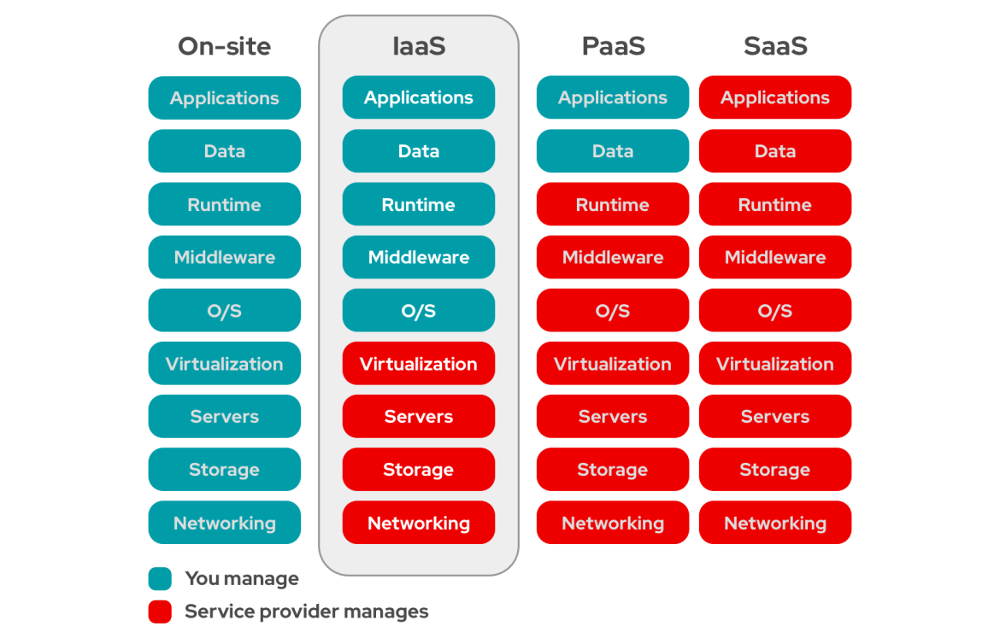

# 01. AWS Cloud Practitioner

## AWS 자격 전반 개요

- AWS 자격증 중 가장 기초적인 자격증
- 최근에 CLF-C01에서 CLF-C02로 업데이트
- 인기있는 AWS 어소시에이트(SAA-C03), 프로페셔널(SAP-C02)보다 쉽고 전문적 경험이 없어도 가능

### AWS 인증 자격

- AWS Foundational: 기본 과정
  - [Cloud Practitioner](https://aws.amazon.com/ko/certification/certified-cloud-practitioner/): 현실적인 취준생 목표
- AWS Associate: 준전문가 과정
  - Solution Architecture
  - Developer
  - SysOps Administrator
- AWS Professional: 전문가 과정
  - Solution Architecture
  - DevOps Engineer
- AWS Specialty: 특화 과정
  - Data Analytics
  - Security
  - Database
  - 

## 클라우드 컴퓨팅 개요

- 대표적으로 넷플릭스를 예로 들면 영상을 요청하는 클라이언트와 이를 제공하는 서버의 구조, 즉 클라이언트-서버 구조의 형태를 띄고 있다.
- 또한 넷플릭스는 AWS 기반 마이크로 서비스 아키텍처를 사용한다.
- 이런식으로 현대적인 웹 서비스의 IT 리소스 관리 전략을 통틀어 **클라우드 컴퓨팅**이라고 한다.
  - 이때 각 서비스의 기능을 아는 수준이 프랙티셔너, 이를 구조화할 수 있는 수준이 어소시에이트라고 보면 된다.

### 서버 가상화

- 가상화는 클라우드의 대표적인 기술적 특징으로 물리적인 하나의 장치 요소를 가상환경에서 여러 개로 분할이 가능하다.
- AWS EC2는 서버의 CPU, 메모리, 스토리지를 가상화한 서비스이다.
- 예를 들어 컴퓨터에 4코어 CPU가 있다면 CPU를 가상화하여 1코어 단위로 나눠 사용할 수 있다.
- 또한 코어를 스레드 단위로 나워서 vCPU 단위로 사용할 수도 있다.

### 온프레미스 vs 클라우드

- 간단한 개념
  - 온프레미스 환경: 기업이 상시 운영하는 자체 데이터센터
  - 클라우드 환경: 기업이 필요할 때만 사용하는 AWS의 ECS, Lambda 등 서비스
- 클라우드 환경을 사용하는 이유
  - 자체 데이터센터 운영에는 많은 자원, 인력, 비용 소요
  - 글로벌 서비스를 제공하려면 변동성에 대한 신속한 대응력 필요
  - 글로벌 수백만명의 동시 사용자에게 안정적인 서비스를 제공하기 위해서는 특화된 인프라, 전문 역량, 운영 노하우 필요
- 즉, 글로벌 시장에서 각자 사업 영역에 집중하며 IT 인프라 운영에는 기업 역량을 분산시키지 않는 **역할과 책임 분산 모델(책임 전가 모델)** 을 사용하기 위해 클라우드를 많이 사용한다.

### 클라우드 배포 모델(from NIST)

- 퍼블릭 클라우드: 이용을 신청하는 누구에게나 오픈. AWS 등 다수
- 프라이빗 클라우드: 기업 전용 클라우드. OpenStack 등 다수
- 커뮤니티 클라우드: 특정 산업, 특정 업무에 집중. Salesforce 등 다수
- 하이브리드 클라우드: 퍼블릭 + 프라이빗. 국내외 주요 기업 및 기관 대부분이 채택하고 있는 배포 모델. 신한투자금융 MTS 아키텍처 등 다수

### 클라우드의 5대 특성(from NIST)

- 온디맨스 셀프 서비스: 사용자가 직접 리소스 프로비저닝(사용하고 활성화하고)
- 광대역 네트워크 접속: 네트워크를 통해 리소스에 접속 및 사용
- 멀티-태넌시, 리소스 풀링: 동일한 물리적 리소스를 여러 고객이 공유
  - 리소스 풀링: 한 번에 고성능 컴퓨터를 수백대 가지고 이를 네트워크로 나워 사용하자. 즉 대규모 리소스를 만들고 네트워크로 나눠 쓰자.
  - 멀티-태넌시: 하나의 것을 일정 비용을 내고 나눠쓰는 것. 예를 들어 한 건물에 여러 집을 돈을 내고 나눠 쓰는 것에 비유
- 탄력성 및 확장성: 필요 시 자원을 자동으로 신속하게 생성 및 제거
  - 갑자기 많이 필요하거나 줄여야 할 때 신속히 반응 가능
- 사용량 모니터링: 리소스 사용량을 정확하게 측정 및 과금 가능

### 클라우드 3대 서비스 유형(from NIST)

- IaaS(Infrastructure as a Service)
  - 사용자가 수정 가능한 컴퓨트, 스토리지, 네트워크, 데이터베이스 인프라를 제공
  - 기존 온프레미스 데이터센터와 클라우드 리소스의 호환성 유지에 적합
  - 유연성, 통제성이 높으나 복잡성 역시 높다.
  - 클라우드 초기에 각광. 서버 컴퓨터 다루듯이 직접 다룰 수 있다.
  - 대표적으로 AWS EC2가 있음
- PaaS(Platform as a Service)
  - 사용자는 인프라 관리 부담 없이 오직 애플리케이션 배포 및 관리에만 집중 가능
  - 대표적으로 Elastic Beanstalk 등이 있음
- SaaS(Software as a Service)
  - 사용자는 애플리케이션 활용에만 집중
  - 대표적으로 SageMaker, Rekognition, 넷플릭스, 에어비앤비, 드롭박스 등

- 위 그림은 [Red Hat](https://www.redhat.com/en/topics/cloud-computing/what-is-iaas)에서 IaaS 등을 설명하는 그림이다.
- 클라우드 산업 초기에는 유연성이 높은 IaaS 모델을 선호했지만 시간이 갈수록 클라우드에서 대부분 관리해주는 방향으로 가고 있음

### 클라우드의 장점 6가지

- 자본적 비용 (CAPEX) 절감
  - 자체 데이터 센터를 업그레이드 하는 등의 비용이 한 번에 수백억씩 발생할 수 있다.
  - 이를 감당하긴 어렵지만 일년에 10억 정도 사용할 수 있을 때 클라우드를 사용하겠다.
  - 간단하게 말하면 대규모 투자 비용을 절감할 수 있다.
- 규모의 경제(비용효율성 증대)
  - 클라우드에서 구현하는 데이터센터는 데이터센터의 데이터센터라고 할만큼 방대한 규모로 만든다.
  - 이를 통해 각 서버에서 이용하는 비용을 낮출 수 있다.
- 적정 용량 예측을 하지 않아도 된다.
  - 예를 들어 데이터 센터를 업그레이드 하려고 예상 사용 범위를 측정하여 업그레이드 했는데 이를 넘어서거나 너무 많이 남는 경우가 있을 수 있다.
  - 클라우드는 이러한 변동성에 대해 대응이 가능하기에 예측 하지 않아도 된다.
-  민첩성 향상(수익 최대화, 손실 최소화)
  - 만약 두바이에 어떠한 사업을 빠르게 시작해야 하는데 온프레미스를 사용하면 인프라를 구축하는데 시간과 비용이 많이 소요된다.
  - 그에 반해 클라우드는 바로 도입 할 수 있다.
  - 해외 지사를 열거나 닫는 것이 민첩하다.
- 기존 데이터센터 증설 및 운영 부담 감소
  - 데이터센터의 규모가 너무 커져 증설이 부담되고 데이터센터를 운영할 인력 역시 부담된다.
  - 클라우드는 이러한 단점을 커버할 수 있다.
- 글로벌 수요 증가에 대응하여 즉시 인프라 배포 가능

### 클라우스 서비스별 다양한 과금 모델

- 사용시간 과금
  - 사용시간에 따라서 과금
  - 대표적으로 AWS EC2
- 저장용량 과금
  - 저장 용량에 따라서 과금
  - 대표적으로 AWS S3
- 전송용량 과금
  - VPC 요소인 NAT 디바이스는 전송 용량에 따라 과금

- 그 외에도 다양한 과금 방식 및 혼합 과금 방식이 있다.

### 클라우드 컴퓨팅 정리

- 그리드컴퓨팅, 리소스-풀, 가상화 등 기술
- 컴퓨트, 스토리지, 데이터베이스 등을 가상화하여 사용자가 필요로 할 때, 사용량만큼 비용을 지불할 수 있도록 함
- 탄력성: 요구되는 처리량에 따라 자유로운 리소스 확대 및 축소 가능
- 용이성: 매우 복잡한 구성의 인프라를 간편하게 사용할 수 있도록 함
- 신뢰성 및 복원성: 데이터 손실 최소화, 서비스 접속불능 시간 최소화
